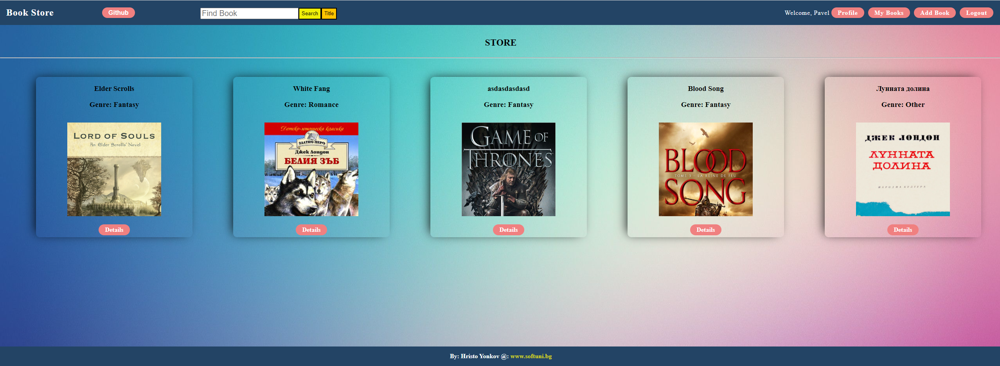

# Angular-My-Project
First start with exam, them we will see !
<picture>
 <source media="(prefers-color-scheme: dark)" srcset="YOUR-DARKMODE-IMAGE">
 <source media="(prefers-color-scheme: light)" srcset="YOUR-LIGHTMODE-IMAGE">
 
</picture>
